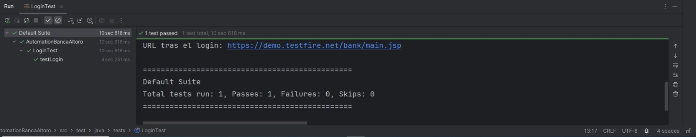

# Automation Framework - Banca Altoro Mutual

Este proyecto es un framework de automatización profesional diseñado para validar el flujo de inicio de sesión en la plataforma bancaria **Altoro Mutual**. Está construido siguiendo las mejores prácticas de la industria, como el patrón de diseño **Page Object Model (POM)**.
## 🔗 Aplicación Bajo Prueba (AUT)
El entorno de pruebas utilizado para este proyecto es:
[Altoro Mutual Demo Site](https://demo.testfire.net/login.jsp)
## 🚀 Tecnologías Utilizadas
* **Lenguaje:** Java 17
* **Gestor de Dependencias:** Maven
* **Automatización Web:** Selenium WebDriver
* **Framework de Pruebas:** TestNG
* **Patrón de Diseño:** Page Object Model (POM)
* **Control de Versiones:** Git & GitHub

## 📂 Estructura del Proyecto
* `src/main/java/pages`: Contiene los objetos de página (Locators y Acciones).
* `src/test/java/tests`: Contiene los scripts de prueba.
* `src/test/java/utils`: Clases de soporte como el lector de configuraciones.
* `src/test/resources`: Archivos de propiedades y datos externos.

## 🛠️ Configuración y Ejecución
1. Clonar el repositorio.
2. Asegurarse de tener instalado **JDK** y **Maven**.
3. Configurar las credenciales en `src/test/resources/config.properties`.
4. Ejecutar los tests desde IntelliJ (clic derecho en `LoginTest`) o mediante Maven:
   ```bash
   mvn test
### Evidencia de Ejecución
Aquí puedes ver que el test de login funciona correctamente:


## ⚙️ Cómo ejecutar el proyecto
1. Clonar el repositorio.
2. Abrir en **IntelliJ IDEA**.
3. Cargar las dependencias desde el archivo `pom.xml`.
4. Ejecutar el archivo `LoginTest.java`.
## 👤 Autor
JESUS GIL VARGAS - Junior Automation Engineer